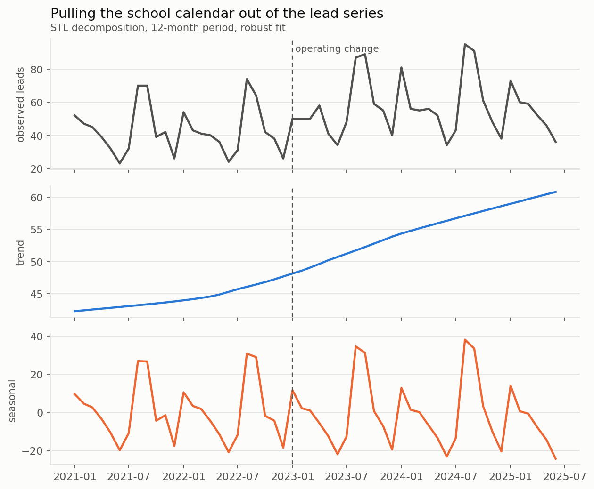
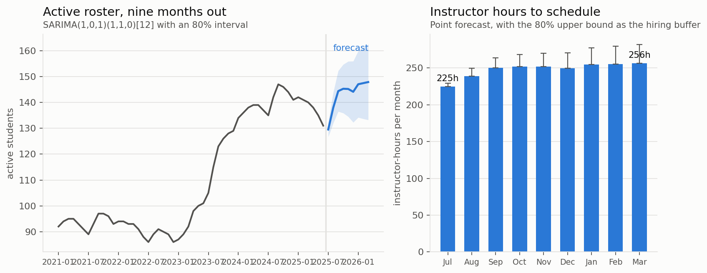

# The school calendar, and what it does to a before-and-after number

*Synthetic data. `src/forecast.py` runs everything below.*

This section starts by attacking the rest of the repository.

README.md compares a "before" window to an "after" window and reports the
improvement. Those windows contain different months of the school year. A tutoring
centre's lead flow swings by **63 leads a month** peak to trough, which is larger
than almost any operating change anyone will ever make, so part of every
before-and-after number in this repo is calendar rather than management until
someone checks.

---

## 1. Decompose first, compare second



STL with a 12-month period and a robust fit, which matters because a single
enrollment-season outlier will otherwise bend the seasonal component around itself.

| | lead lift, before vs after |
|---|---|
| raw comparison | **+31.8%** |
| after removing the seasonal component | **+34.5%** |

The calendar accounted for **−5.5%** of the raw gap. Negative: the "after" window
happened to contain a slightly *worse* seasonal mix than the "before" window, so the
raw comparison **understated** the operating improvement rather than inflating it.

That is not the result I expected when I wrote the check, and it is the reason to
run it. The instinct is that seasonality flatters a before-and-after story. Here it
did the opposite, and reporting the direction I assumed instead of the one I
measured would have been the easier and wrong thing to do.

The correction is small in this data because the windows are two years and one and a
half years long, so both average over multiple full cycles. It would be large and
dangerous on the six-month comparison a franchise owner is far more likely to run.

---

## 2. Backtest before you trust anything

Rolling origin, 22 forecast origins, three-month horizon, no model ever seeing data
past its origin.

| model | MAE | RMSE | vs seasonal naive |
|---|---|---|---|
| **SARIMA(1,0,1)(1,1,0)[12]** | **3.13** | 4.40 | **0.84** |
| seasonal naive | 3.74 | 5.20 | 1.00 |
| Fourier + trend | 3.91 | 4.59 | 1.05 |
| drift | 6.04 | 7.48 | 1.61 |

Note who the competition is. **Seasonal naive** is "this month last year," it takes
one line, and it beat the Fourier regression. Any forecasting exercise that does not
report a naive baseline is hiding something, because roughly half the time the naive
baseline wins and the model was a waste of a fortnight.

SARIMA earns a 16% improvement over it. That is a real win and it is also a modest
one, which is the honest size of most forecasting wins on 54 months of monthly data.

---

## 3. The forecast is a staffing decision



Nine months of the active roster with an 80% interval, converted into
instructor-hours at 5.2 sessions per student-month and 3 students per instructor
hour.

- peak month: **256 instructor-hours**
- trough month: **225 instructor-hours**
- swing: **32 hours**, about **$763** of monthly wages

And a point about which end of the interval to staff to. The cost of being wrong is
asymmetric. Over-staffing in a slow month costs one month of wages for the surplus
hours. Under-staffing in enrollment season means turning families away in the only
weeks of the year when they are all shopping at once, and those students do not come
back in November. So the hiring number is the upper bound of the interval, not the
point forecast, and the chart draws the buffer for exactly that reason.

That asymmetry is the whole reason to produce an interval rather than a number. A
point forecast invites you to staff to the middle, which is the wrong answer in both
directions.

---

## Run it

```bash
python src/generate_data.py   # 54 months with school-calendar seasonality
python src/forecast.py        # decomposition, backtest, forecast, staffing
```
