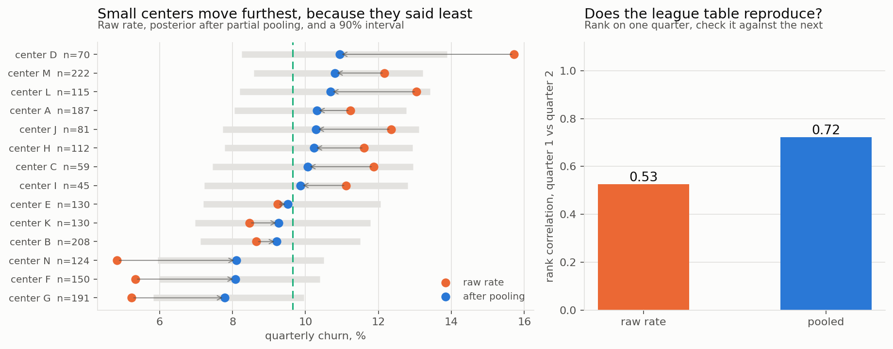

# The league table is noise

*Synthetic data. `src/hierarchical.py` runs everything below.*

A franchise owner with fourteen centers wants a ranking, and the obvious one is
churn rate per center, sorted. It is close to useless, and the reason is not
subtle: the smallest center here has 45 students, so three extra departures move
it most of the length of the table.

**Ranking on a noisy estimate ranks the noise.** Small units have wide sampling
distributions, so they occupy both ends of every league table ever built. The
owner then spends $4,200 flying the regional director out to fix the center at the
bottom, which was average all along.

---

## Partial pooling

Model each center's true rate as a draw from a population distribution, fit that
distribution from all fourteen centers at once, and report each center's posterior
instead of its raw rate.

$$y_j \sim \text{Binomial}(n_j, p_j), \qquad p_j \sim \text{Beta}(a, b)$$

Conjugacy makes the posterior closed form:

$$p_j \mid y_j \sim \text{Beta}(a + y_j,\ b + n_j - y_j), \qquad
\mathbb{E}[p_j \mid y_j] = \frac{a + y_j}{a + b + n_j}$$

which is the raw rate and the population mean averaged with weights $n_j$ and
$a+b$. So $a+b$ is a **prior sample size**, and the shrinkage is not a knob anyone
chose. Integrating the $p_j$ out gives a Beta-Binomial marginal likelihood in
$(a,b)$, and maximising that is the whole fit.



Here $a+b = 262$, so a 45-student center is pulled **85%** of the way to the
population mean and a 222-student center barely moves. The data sets the weight.

---

## Does the ranking reproduce?

This is the part I would put in front of an owner, because it settles the argument
without any statistics vocabulary at all. Rank the centers on one quarter, then
check that ranking against the next quarter. A real ordering reproduces. Noise does
not.

| ranking | rank correlation, Q1 against Q2 |
|---|---|
| raw churn rate | **0.53** |
| after pooling | **0.72** |

And the number that ends the conversation:

**Centers we can say are genuinely worse than the population mean, at 90%
confidence: none.** Not one, out of fourteen. The 90% posterior intervals all
straddle the mean. The table has a top and a bottom because tables do, not because
the centers differ enough to act on.

That is a $4,200 saving per avoided visit and it is the whole deliverable.

---

## Where the method fails, which is worth more than where it works

On the single sample plotted above, pooling made the point estimates **worse**:
MSE 0.000359 against 0.000206 for the raw rates. I am leaving that in rather than
picking a friendlier seed, because the reason is the interesting part.

The fitted concentration came out at $\kappa = 261$ against a true value of 50.
Empirical Bayes fits the hyperparameters from the same data and then treats them as
known, and with only fourteen groups the marginal likelihood is biased toward large
$\kappa$, which means too much shrinkage. On this draw the estimates were pulled
past the truth.

So I measured where that stops mattering, over 25 replications at each size:

| centers | median fitted $\kappa$ | MSE raw | MSE pooled | gain |
|---|---|---|---|---|
| 10 | 61 | 0.00120 | 0.00101 | 16% |
| 14 | 73 | 0.00090 | 0.00070 | 23% |
| 25 | 60 | 0.00108 | 0.00084 | 22% |
| 50 | **50** | 0.00109 | 0.00073 | 33% |
| 100 | **51** | 0.00104 | 0.00068 | 34% |
| 200 | **52** | 0.00114 | 0.00074 | 35% |

Two readings.

Pooling wins **on average at every group count**, from 16% at ten centers to 35% at
two hundred, and the fitted $\kappa$ converges on the true 50 from about fifty
groups onward.

And it can still lose on any individual sample, which is exactly what a
risk-reduction result means and exactly the part people mishear. "Shrinkage
dominates" is a statement about expected loss over repeated sampling, not a promise
about the dataset on your desk. Anyone who has only seen the theorem tends to expect
the guarantee to be pointwise, and it is not.

The fix for the small-group case is to stop treating $(a,b)$ as known and integrate
over them too, which is a genuine hierarchical model rather than an empirical-Bayes
approximation. At fourteen groups that is worth doing. At two hundred it is not.

---

## What to do with it

**Stop publishing the raw league table.** It ranks sample size at least as much as
performance, and every quarter it sends someone to a different center for no reason.

**Report the posterior interval, not the point.** If the intervals overlap, and here
every one of them does, then the honest answer to "which center is worst" is that
the data cannot tell you.

**If you need to find a genuinely bad center, get more data per center rather than
more centers.** The uncertainty is driven by $n_j$, and no amount of cleverness with
fourteen quarterly numbers substitutes for a year of them.

---

## Run it

```bash
python src/hierarchical.py
```
