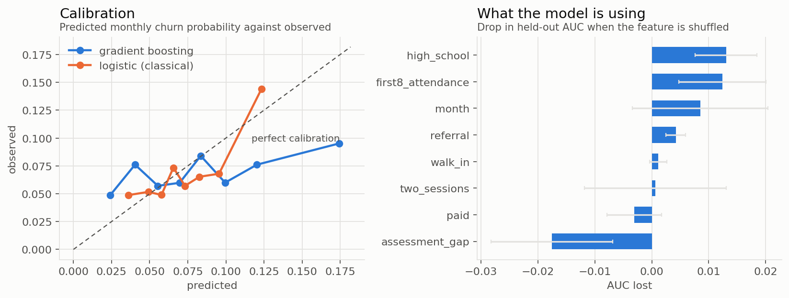

# Who leaves next, and why the gradient booster lost

*Synthetic data. `src/risk_model.py` runs everything below.*

RETENTION.md describes a population. An owner cannot call a population. This turns
the survival model into a ranked list of students with a dollar figure attached, and
along the way produces the result I find most useful to show people: **the flexible
model lost to logistic regression, and I can prove there was nothing left for it to
win.**

---

## The setup: survival as classification

Expand each student into one row per month they were at risk. The outcome is 1 in
the month they left and 0 otherwise. Then fit anything to

$$h(t \mid x) = \Pr(\text{leaves in month } t \mid \text{enrolled at start of } t,\ x)$$

That quantity is the discrete hazard, so the classifier and the survival model are
the same object. Multiply back along a path to recover a personal survival curve:

$$\hat S(t \mid x) = \prod_{k \le t}\bigl(1 - \hat h(k \mid x)\bigr)$$

Censoring needs no special handling. A student still enrolled at the cut simply
stops contributing rows, and the model reads that as "survived at least this long,"
which is exactly what it means.

1,400 students become **11,675 person-months**.

### The split has to be on students

A student contributes many correlated rows. Splitting the expanded frame at random
puts the same person on both sides and the held-out score becomes meaningless.
Calling `train_test_split` on the person-period frame is the single most common way
this model gets reported wrong, and it inflates AUC by enough to look like a win.

Here: 1,050 students train, 350 test, no student on both sides.

---

## The result

| model | held-out AUC | Brier |
|---|---|---|
| gradient boosting | 0.545 | 0.0661 |
| **logistic regression** | **0.598** | **0.0642** |

The gradient booster lost, on both discrimination and calibration. That is not a
tuning failure I neglected to fix. It is the correct outcome, and the interesting
question is how anyone would know that rather than reaching for more trees.

---

## Proving there was nothing left to win

Synthetic data buys exactly one luxury: the truth is on disk. Each student's real
hazard is $z_i \lambda \exp(\beta^\top x_i)$, and `data/oracle_hazards.csv` stores
it. Score the held-out rows with numbers no model is allowed to see, and you get a
ceiling instead of a guess.

| scorer | AUC |
|---|---|
| gradient boosting | 0.545 |
| logistic regression | 0.598 |
| oracle knowing the true covariate effects $\lambda e^{\beta^\top x}$ | 0.591 |
| **oracle knowing each student's true hazard $z_i \lambda e^{\beta^\top x}$** | **0.721** |

Read those two oracle rows carefully, because together they say the whole thing.

**Logistic regression already beat the covariate oracle.** A model that knows the
exact generating coefficients scores 0.591; the fitted model scores 0.598. It is not
sorcery: the fitted model also sees elapsed tenure, and under frailty how long a
student has already lasted is itself evidence about their $z$. The covariates were
fully exploited. There was no remaining structure in them for trees to find, which
is precisely why flexibility bought nothing and cost variance.

**The gap to the full oracle is $0.721 - 0.598 = 0.123$ AUC**, and that gap is the
frailty. It is 56% of all the signal above chance. No feature engineering reaches
it, no model class reaches it, no amount of tuning reaches it, because $z$ is not a
function of anything in the dataset. It is the part of a student that the center
never wrote down.



Permutation importance agrees, and it is worth noting it disagrees with intuition:
the largest single contributor is `high_school`, narrowly ahead of
`first8_attendance`. Both matter. Neither matters much, because most of what decides
whether a student stays was never recorded.

### So what do you actually do

**Stop modelling and start instrumenting.** The honest recommendation from a 0.123
AUC ceiling is that the next win is in data collection, not in `n_estimators`.
Something that proxies $z$: attendance trajectory rather than a first-eight-week
average, whether a parent ever replies to a progress email, grade movement in the
student's actual class, whether they show up in the week after a bad session. Any
one of those plausibly carries more than the entire existing feature set.

That is a several-thousand-dollar recommendation delivered by a model that scored
0.598, and it is worth more than the same model tuned to 0.61.

---

## Deployment

The pipeline deploys whichever model won on held-out data, which here is the
logistic one. That is a one-line decision in code rather than a preference, so if
real data changes the answer the pipeline follows it.

Calibration is why. A ranked call list needs only discrimination, so ordering is
enough. The moment you attach a dollar figure you need the probabilities themselves
to be right, because a model that says 12% where the truth is 30% makes every
expected value wrong by a factor of two and a half. The Brier scores and the left
panel above are the check that matters for what this is used for.

---

## The deliverable

`data/call_list.csv`, regenerated on every run. For each of the 570 still-enrolled
students:

$$\text{value at risk} = \Pr(\text{leaves within 3 months}) \times \mathbb{E}[\text{remaining months}] \times \text{tuition} \times \text{margin}$$

Ranking on churn probability alone is the mistake an owner will spot immediately: a
student with two months left in them is not worth the same phone call as one with
two years. The product is what to sort on.

Current output: **$216,000 of contribution margin at risk** across 570 active
students over a three-month window.

And one finding that changes the shape of the intervention. The top 25 students
carry only **5%** of that total. The risk is spread thin rather than concentrated,
so there is no heroic short call list that captures most of the value. Whatever the
center does has to be systematic and cheap enough to apply broadly, not a
hand-picked rescue mission. A model that produced a tidy top-25 list would have been
more satisfying and less true.

---

## Run it

```bash
python src/generate_students.py   # writes students.csv and oracle_hazards.csv
python src/risk_model.py          # metrics, charts, call_list.csv
```
