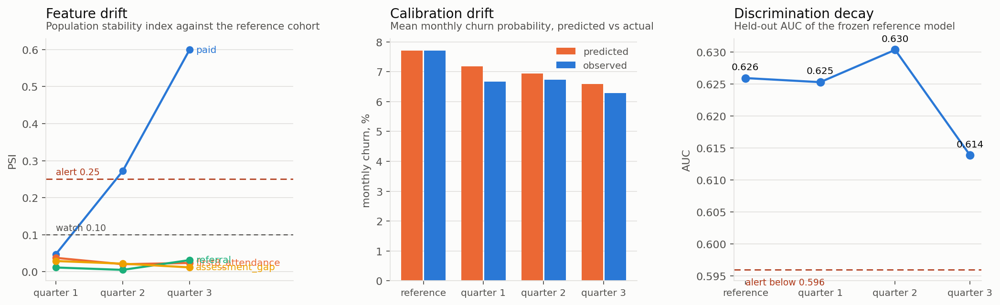

# The model breaks because the marketing worked

*Synthetic data. `src/monitoring.py` and `src/score.py` run everything below.*

The retention model in MODELING.md was fitted on a roster whose students came mostly
from paid search. The entire point of the work in README.md was to stop buying those
students and start earning organic and referred ones. That succeeded.

So the population the model scores is no longer the population it learned from.
Nobody broke anything and nobody was careless. **Improving the business is a
covariate shift**, and a model nobody is watching gets quietly worse at precisely
the moment its owner is celebrating.

This is the part of a machine learning system that contains no machine learning and
decides whether the thing is still working two years later.

---

## What was measured

Four intake cohorts. The channel mix moves across them the way the centre's actually
did, from 55% paid down to 18% paid. Nothing else about the generating process
changes. A model is fitted on the reference cohort, frozen, and then scores the
other three.



### Feature drift, by population stability index

$$\text{PSI} = \sum_i (c_i - r_i)\ln\frac{c_i}{r_i}$$

which is the symmetrised Kullback-Leibler divergence between two binned
distributions. That is why the conventional 0.10 and 0.25 thresholds transfer across
problems instead of needing recalibration per project.

One implementation detail that is easy to get wrong: **the bin edges come from the
reference window and are then frozen.** Recomputing quantile edges on current data
hides the very shift the statistic exists to detect, and it is a bug that produces a
reassuring flat line forever.

| cohort | PSI on `paid` | worst other feature |
|---|---|---|
| quarter 1 | 0.047 | 0.037 |
| quarter 2 | **0.272** | 0.022 |
| quarter 3 | **0.599** | 0.031 |

By quarter 3 the drift on the channel feature is more than twice the conventional
alert threshold. In most shops that fires a retrain.

### Except the model was fine

| cohort | predicted churn | observed | calibration error | AUC |
|---|---|---|---|---|
| reference | 7.71% | 7.71% | 0.0% | 0.626 |
| quarter 1 | 7.19% | 6.68% | 7.7% | 0.625 |
| quarter 2 | 6.94% | 6.73% | 3.1% | 0.630 |
| quarter 3 | 6.58% | 6.29% | 4.7% | 0.614 |

Calibration never drifts past 8%. Discrimination moves by 0.012 of AUC, which is
inside the noise. **A PSI of 0.6 produced no measurable damage.**

That is the finding worth keeping. The distribution of a *feature* moved a long way.
The relationship between features and outcome did not. Covariate shift without
concept drift does not hurt a correctly specified model, because the model is
estimating a conditional and the conditional is unchanged.

PSI on its own is a false-positive machine. A team that retrains on every PSI breach
burns a week per quarter and, worse, teaches everyone to ignore the alert. An
ignored alert is more dangerous than no alert, because it produces the paperwork of
monitoring without the function.

---

## The alert rule

Fire only when **two of three** independent signals agree:

- worst-feature PSI ≥ 0.25
- calibration error ≥ 30%
- AUC drop ≥ 0.03 from reference

| cohort | verdict |
|---|---|
| quarter 1 | healthy |
| quarter 2 | watch |
| quarter 3 | watch |

The frozen model is still fit for purpose after its input distribution moved by more
than a factor of three on the dominant feature. The correct action is to keep
watching, which the rule says and a PSI threshold alone would not.

The single-signal case that should always alarm you is the reverse of this one:
calibration drifting while PSI stays flat. That is concept drift, the inputs look
familiar and the world has changed underneath them, and it is both the more dangerous
failure and the one nobody instruments for.

---

## Making it a system rather than an analysis

`src/score.py` is the boundary between the two. It can be run by someone who did not
write it, on data it has not seen, without a notebook.

```bash
python src/score.py train --data data/students.csv --out models/retention.pkl
python src/score.py score --model models/retention.pkl --top 40
python src/score.py check --model models/retention.pkl --data data/new_roster.csv
```

`train` fits both candidate models, keeps whichever won on held-out students, and
writes one artifact carrying the model, the frozen feature order, the reference
distribution needed for later drift checks, and a SHA-256 fingerprint of the rows it
was fitted on. Every scored output records both fingerprints, so any call list can be
traced to the exact training data behind it.

`score` validates before it predicts. Missing columns, out-of-range values, and
channel values the model has no coefficient for all stop the run. The failure this
prevents is the one that matters: a silently reordered or renamed column produces
confident, wrong, unnoticed numbers for six months, and nothing about the output
looks wrong while it happens.

`check` runs the drift monitor against the stored reference and **exits with code 2
when it says retrain**, so it can sit in cron or CI and actually block something
rather than printing into a log nobody reads.

That exit code is the difference between monitoring and having monitoring.

---

## Run it

```bash
python src/monitoring.py                  # the cohort study above
python src/score.py train && python src/score.py check
```
