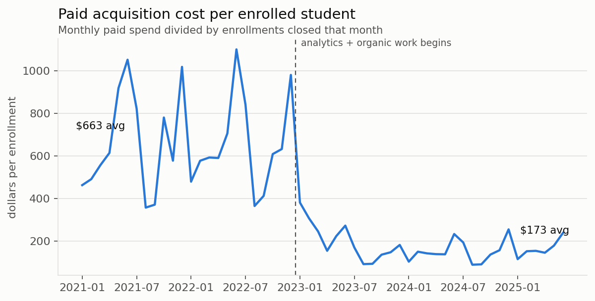
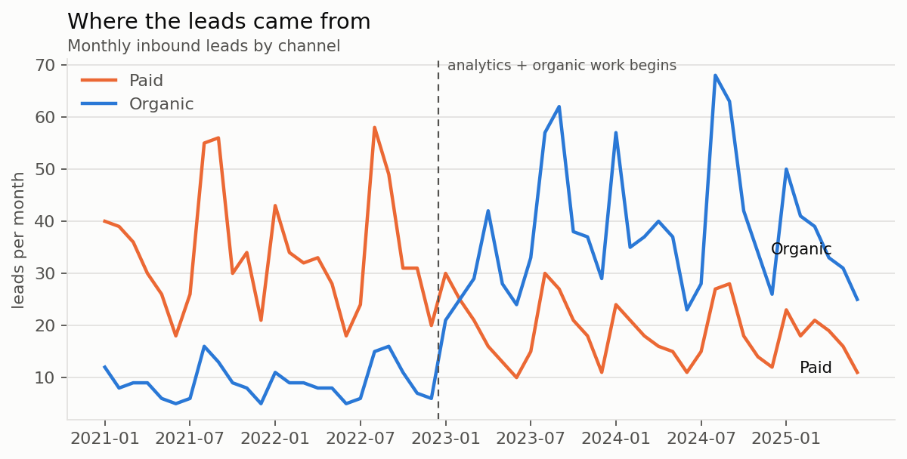
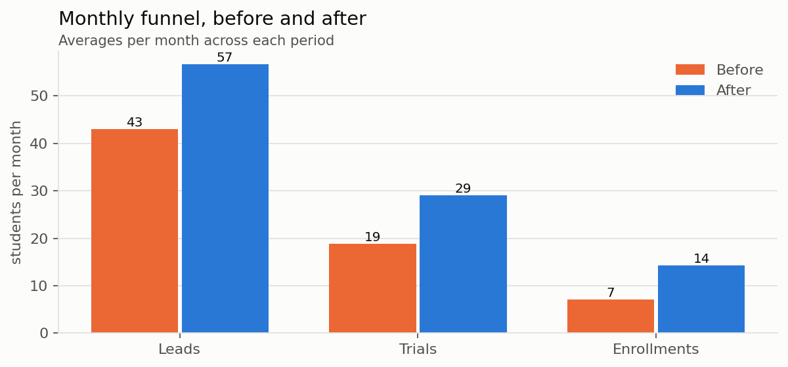
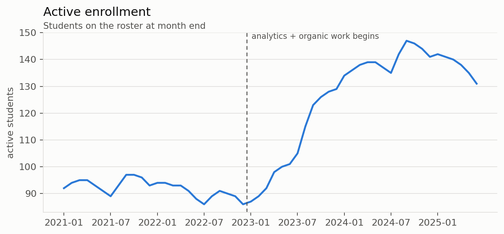

# Tutoring center analytics

Marketing and enrollment analysis for a math tutoring franchise center: where the
students came from, what each one cost to acquire, and how long they stayed.

**The data in this repository is synthetic.** I generated it. I ran this analysis
against a real center's numbers while I was Assistant Center Director and Director
of Marketing and Analytics there, and those numbers are not mine to publish. What
is real here is the structure: the tables are at the grain a franchise center
actually keeps them, the questions are the ones the owner actually asks, and the
pipeline is the one I actually ran. Point `data/center_monthly.csv` at real figures
and every number below recomputes.

---

## The four questions

An owner does not want a dashboard. They want four answers.

### What does a student cost to acquire, and is it going down?



Cost per *lead* is the number most marketing reports show, and it is the weaker
cousin. Cost per *enrolled student* is the one attached to money coming in, so it
is the one on the first chart.

### Where are the leads coming from?



The interesting event is not the paid line falling. It is the two lines crossing,
because after the crossing the center's lead flow no longer stops when the ad
budget does.

### Is the funnel converting better, or just wider?



Worth separating. More leads at the same conversion rate is a spend story. Better
conversion at fewer paid leads is an operating story, and only the second one
survives a budget cut.

### Is the roster growing?



---

## Results

Recomputed on every run. Current output:

- Active enrollment: **92 to 131** students, up 42%
- Paid cost per enrolled student: **\$587 to \$169**, down 71%
- Monthly paid spend: **\$4,227 to \$2,291**, down 46%
- Organic share of leads, final six months: **70%**
- Monthly churn: **5.9% to 3.9%**, moving average student tenure from **17 to 26 months**
- Funnel, monthly averages: 44 leads / 19 trials / 7 enrollments before,
  58 / 30 / 14 after

Note what the churn line does to the rest. At 5.9% monthly churn a student is worth
about 17 months of tuition. At 3.9% it is 26. That is a larger change in the value
of the business than the acquisition cost drop, and it is invisible on any chart
that only tracks new enrollments.

That "17 to 26 months" is the standard 1/churn conversion, and it is wrong for a
reason worth its own document. [RETENTION.md](RETENTION.md) works out what the
number actually is and what it costs you to use the shortcut.

---

## Run it

```bash
pip install -r requirements.txt
make            # regenerates every number, chart and CSV, then runs the tests
```

Or step by step: `make data`, `make analysis`, `make survival`, `make risk`, `make test`.

No framework, no configuration beyond two dictionaries.

- `src/generate_data.py` and `src/generate_students.py` build the synthetic history,
  monthly and student-level. Everything adjustable lives in the `CONFIG` block at
  the top of each.
- `src/analyze.py` does the monthly funnel and acquisition analysis.
- `src/survival.py` does Kaplan-Meier, Cox, the frailty fit, and lifetime value.
- `src/risk_model.py` does the discrete-time hazard model and the call list.
- `src/uplift.py` simulates the randomised trial and fits four causal estimators.
- `src/forecast.py` does the STL decomposition, the backtest and the staffing forecast.
- `src/monitoring.py` does drift, calibration decay and the alert rule.
- `src/hierarchical.py` does the Beta-Binomial partial pooling across centers.
- `src/retrieval.py` does BM25, LSA, hybrid fusion and the retrieval evaluation.
- `src/score.py` is the CLI: train, score, check.
- `tests/` holds 29 tests that check claims rather than smoke. RMST against the
  exponential closed form, Kaplan-Meier against a five-subject case computed by
  hand, the frailty MLE recovering a known theta, PSI staying blind to nothing when
  the reference bins are frozen, a Qini that refuses to reward a random score, and a
  guard that no student ever lands in both train and test.

---

## Notes on the charts

The two series colors were checked with a colour-vision-deficiency validator rather
than chosen by eye. The worst adjacent pair separates by ΔE 24.7 under protanopia,
well above the 8 threshold, and every series is also directly labelled so identity
never depends on colour alone. No dual axes anywhere: two measures on different
scales get two charts.

Small thing, but a chart that a red-green colourblind reader cannot decode is a
chart that roughly one man in twelve cannot use, and the check takes a second.

---

## The retention analysis

The monthly aggregates above answer "how many." They cannot answer "which students,
and what is one worth," because a monthly churn rate is a summary statistic with an
assumption buried in it.

**[RETENTION.md](RETENTION.md)** does that properly, at student level: Kaplan-Meier
with censoring, Cox proportional hazards, a gamma-frailty model fitted by maximum
likelihood, and lifetime value recomputed off the survival curve.

It ends on a decision. The naive method values paid search at 3.09 dollars returned
per dollar spent, which clears the conventional 3:1 floor. Doing it correctly gives
2.70, which does not. Same students, same spend.

It also contains the result I find most useful and least intuitive: the churn rate
in this data falls steeply over time even though **no individual student's risk ever
changes**. That has a specific consequence for what you should do about it.

## Predicting who leaves next

**[MODELING.md](MODELING.md)** turns the survival model into a ranked call list with
a dollar figure on each name, using a discrete-time hazard model on 11,675
person-months.

It is also the piece I would point an interviewer at first, because the gradient
booster lost to logistic regression and the document proves there was nothing left
for it to win. Because the data is synthetic, the true per-student hazard is on
disk, so the ceiling any model could reach is computable rather than arguable: 56%
of all the signal above chance is unobservable heterogeneity. The recommendation
that falls out is to stop tuning and start collecting a different variable.

## Who to call, which is a different question

**[UPLIFT.md](UPLIFT.md)** is the one with the most surprising result in it. The call
list from the previous section ranks students by how likely they are to leave, and
calling down that list turns out to be **worse than calling people at random**.

Churn probability and treatment effect are different quantities, and on this data
they are almost uncorrelated. The students most likely to leave are the ones a
retention call cannot help. Getting it right needs a randomised trial and a causal
estimator rather than a predictive one, and the write-up compares four of them, then
works out the intervention cost at which any of this stops being academic and starts
paying for itself.

## Seasonality, and a correction to this page

**[FORECASTING.md](FORECASTING.md)** starts by attacking the numbers above. The
before-and-after windows contain different months of the school year, and lead flow
swings by 63 a month peak to trough, which is larger than most operating changes
anyone ever makes.

Removing the seasonal component moves the measured lead lift from +31.8% to +34.5%.
The calendar was working *against* the story, not for it, which is the opposite of
what I assumed when I wrote the check. It also holds a rolling-origin backtest
against a seasonal-naive baseline, because roughly half of all forecasting projects
lose to "this month last year" and the ones that do not report a baseline are the
ones hiding it.

The forecast then becomes a staffing number, with a note on why you hire to the top
of the interval rather than the middle.

## The model breaks because the marketing worked

**[MONITORING.md](MONITORING.md)** is the one I would show someone hiring for an ML
engineering role rather than a data science one.

The retention model was fitted on a roster that was mostly paid-search students. The
marketing work replaced them with organic and referred ones. That is a covariate
shift, caused by success, and the population stability index on the channel feature
reaches **0.6**, more than twice the conventional retrain threshold.

The model was fine. Calibration never drifted past 8% and AUC moved 0.012. Feature
drift without concept drift does not hurt a correctly specified model, so a team that
retrains on every PSI breach burns a week a quarter and teaches everyone to ignore
the alert. The composite two-of-three rule is what stops that.

## Fourteen centers and a league table that means nothing

**[HIERARCHICAL.md](HIERARCHICAL.md)** is the franchise-level question: which
centers are actually underperforming?

Ranking them by churn rate ranks the noise, because the smallest center has 45
students and three extra departures move it most of the length of the table. Partial
pooling with a Beta-Binomial fits the population distribution from all fourteen at
once and lets the data set the shrinkage. Rank correlation between consecutive
quarters goes from 0.53 to 0.72, and the number that ends the argument is that
**zero** centers can be called worse than the mean at 90% confidence.

The write-up also keeps the sample where the method made the point estimates worse,
and explains why, because empirical Bayes over-shrinks with few groups and "reduces
risk" is a statement about repeated sampling rather than a promise about your
dataset.

## Asking the handbook a question

**[RETRIEVAL.md](RETRIEVAL.md)** is the retrieval half of a RAG system, evaluated
rather than assumed. BM25 written out by hand, a dense stand-in, and a hybrid, scored
against 24 labelled queries.

Two findings. The four retrievers are **statistically indistinguishable** on an eval
set this size, and the paired bootstrap interval touching zero is the reason to say
so instead of crowning a winner. And chunk size moved recall@5 from 0.875 to 0.958,
about double the spread between any two retrievers, on a parameter almost nobody
tunes.

No API calls. Retrieval quality is measurable offline, cheaply and repeatedly, and
measuring it is what tells you whether spending money on generation is worth anything.

## Running it as a system rather than a notebook

```bash
python src/score.py train --data data/students.csv --out models/retention.pkl
python src/score.py score --model models/retention.pkl --top 40
python src/score.py check --model models/retention.pkl --data data/new_roster.csv
```

`train` keeps whichever model won on held-out students and writes one artifact
carrying the model, the frozen feature order, the reference distribution for later
drift checks, and a SHA-256 fingerprint of the training rows. `score` validates
before it predicts, so a renamed or reordered column stops the run instead of
producing confident wrong numbers for six months. `check` exits with code 2 when it
says retrain, so it can sit in cron and block something.

---

Joseph Park · [wassaw.io](https://wassaw.io) · joseph.park@wassaw.io
