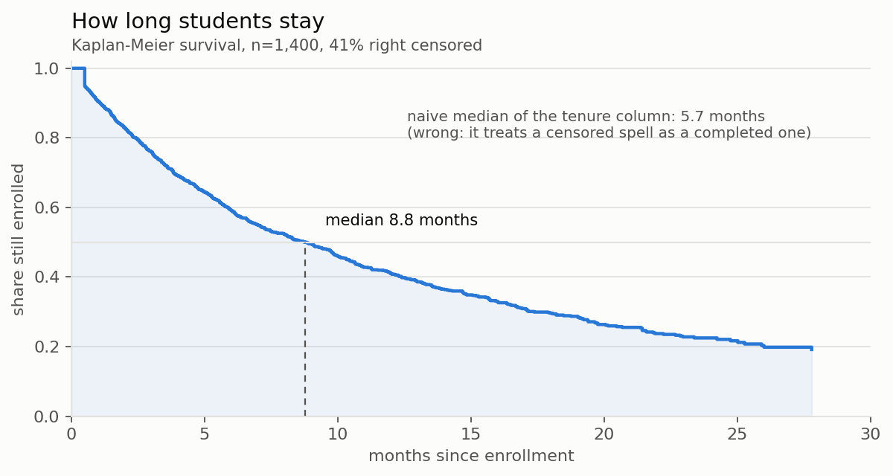
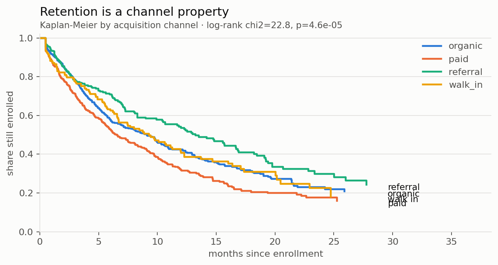
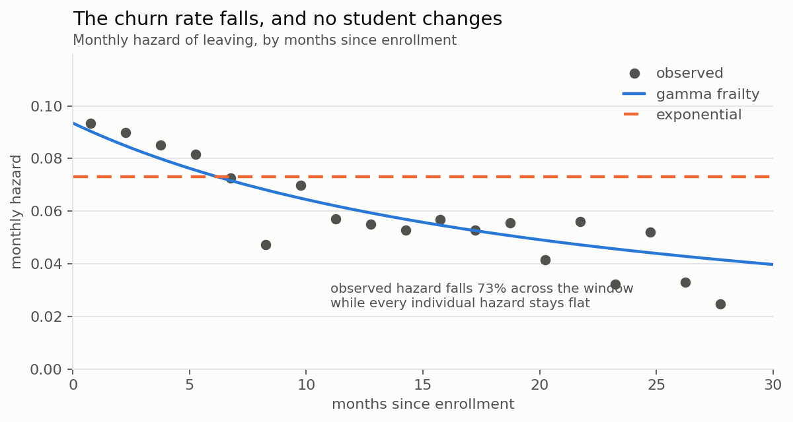
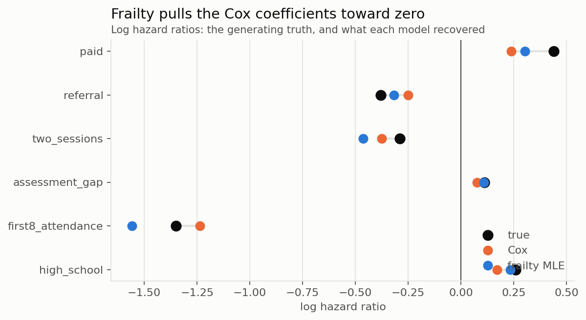
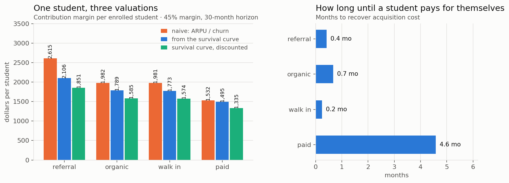

# Retention is a time-to-event problem, and the churn rate is the wrong number

*Synthetic data throughout, for privacy. `src/generate_students.py` says exactly what
generated it and why. The analysis is the one I ran against a real center's records.*

An owner asks one question in four ways. How long do students stay? Which students
leave? What is a student worth? Should I keep buying paid search?

Every one of those is the same question, and the number almost everyone uses to
answer it — a monthly churn rate — is a summary statistic that quietly assumes the
thing it should be measuring. What follows is what happens when you stop assuming it.

The punchline, up front: on this data the naive method says paid search returns
**3.09 dollars per dollar** of acquisition cost and the correct method says
**2.70**. The industry's own rule of thumb is that 3:1 is the floor. Same students,
same revenue, same spend. One of those numbers keeps the campaign running.

---

## 1. You cannot average a tenure you have not finished observing

Of the 1,400 students here, **41% were still enrolled** when the data was cut. Their
spells are *right censored*: we know the student lasted at least $t$ months, not how
long they lasted.

Taking the median of the tenure column treats "still here after 3 months" as
"left after 3 months." It is not a small error:

| | months |
|---|---|
| median of the raw tenure column | **5.7** |
| Kaplan-Meier median | **8.8** |

A 35% understatement, and it points the wrong way for every decision downstream.

The Kaplan-Meier estimator gets it right by only ever conditioning on the people
actually at risk. With $d_j$ departures among $n_j$ students at risk at time $t_j$,

$$\hat S(t) = \prod_{t_j \le t}\left(1 - \frac{d_j}{n_j}\right)$$

Censored students contribute to $n_j$ up to the moment they vanish and then stop
counting. No imputation, no assumption about the shape of anything.



Because the tail here is heavy (section 4 explains why), I report **restricted mean
survival time** rather than a mean:

$$\mathrm{RMST}(H) = \int_0^{H} S(t)\,dt$$

which is the area under the curve out to a horizon $H$ you actually observed. The
unrestricted mean $\int_0^\infty S(t)\,dt$ requires extrapolating past your data,
and under this generating process that extrapolation is where most of the mass
lives. Quoting it would be quoting an assumption.

Overall RMST at 30 months: **12.4 months** per student.

---

## 2. Retention is a property of the channel, not just of the student



Log-rank $\chi^2 = 22.8$, $p = 4.6\times10^{-5}$. The channels are not drawing from
the same distribution.

This is the first result with an operational edge on it. Cost per acquisition is
measured at the door. Retention is measured for two years afterward. If the cheap
channel also keeps students longer, the gap between channels is much wider than the
acquisition report shows, and nobody who only looks at CAC will ever see it.

---

## 3. Which students, not how many

The Cox model estimates covariate effects without committing to a shape for the
baseline hazard, by maximising the partial likelihood over the ordered failure times:

$$L(\beta) = \prod_{i:\,\delta_i=1} \frac{\exp(\beta^\top x_i)}{\sum_{j \in R(t_i)} \exp(\beta^\top x_j)}$$

Each factor asks: given that *someone* in the risk set $R(t_i)$ left at $t_i$, what
was the chance it was this student? The baseline hazard cancels out of the ratio,
which is the whole trick.

| covariate | hazard ratio | 95% CI | p |
|---|---|---|---|
| first 8 weeks attendance (per unit) | **0.29** | 0.15 – 0.57 | <0.001 |
| two sessions per week | **0.69** | 0.59 – 0.80 | <0.001 |
| referral | 0.78 | 0.64 – 0.96 | 0.016 |
| paid search | **1.27** | 1.08 – 1.49 | 0.004 |
| high school | 1.19 | 1.03 – 1.37 | 0.021 |
| assessment gap (per grade level) | 1.08 | 0.99 – 1.17 | 0.068 |
| walk in | 0.98 | 0.78 – 1.23 | 0.862 |

The dominant term is not a marketing variable. **Attendance in the first eight weeks**
moves the hazard by a factor of roughly three across its range, and it is knowable
by week eight, while a student is still enrolled and still reachable by phone.

That is the actionable finding in this whole document. Everything else is context.

---

## 4. The churn rate falls. No student changes. Both are true.



The observed monthly hazard drops from about 9.3% to 2.5% across the window. The
standard reading is that students settle in, which implies an onboarding
intervention.

Here is the problem. **This data was generated with a constant hazard for every
individual student.** Nobody settles in. Not one student's risk falls by a single
basis point. The population curve falls anyway, because of selection: students
differ in their underlying propensity to leave, the high-propensity ones leave
first, and the survivors are a progressively more committed sample. The cohort gets
more loyal without any student getting more loyal.

Write the individual hazard as a fixed frailty $z_i$ times a covariate-shifted
baseline:

$$h_i(t) = z_i \,\lambda \exp(\beta^\top x_i), \qquad z_i \sim \mathrm{Gamma}(1/\theta,\ \theta),\ \ \mathbb{E}[z]=1$$

Integrating the frailty out is exactly evaluating the Laplace transform of the Gamma
density at the cumulative hazard $\Lambda(t) = \lambda_x t$:

$$S(t \mid x) = \mathbb{E}_z\!\left[e^{-z\Lambda(t)}\right] = \bigl(1 + \theta\,\lambda_x t\bigr)^{-1/\theta}$$

and differentiating gives a population hazard that is strictly decreasing for any
$\theta > 0$:

$$\bar h(t) = \frac{\lambda_x}{1 + \theta \lambda_x t}$$

So a declining aggregate hazard is **not evidence of duration dependence**. It is
equally consistent with pure heterogeneity, and the two have opposite implications:
duration dependence says fix onboarding, heterogeneity says fix screening and
expectation-setting at intake. Aggregate data alone cannot separate them.

### Fitting it

The unconditional likelihood collapses to something you can write in four lines.
With $\delta_i$ the event indicator,

$$\ell(\lambda,\theta,\beta) = \sum_i \left[\delta_i \log \lambda_{x_i} - \left(\tfrac{1}{\theta} + \delta_i\right)\log\!\left(1 + \theta \lambda_{x_i} t_i\right)\right]$$

`gamma_frailty_mle` in `src/survival.py` maximises this directly, with standard
errors from a numerical Hessian. No package: the model is four lines of algebra and
writing it out is faster than finding a library that fits it.

Recovered against the known truth:

| | fitted | true |
|---|---|---|
| $\lambda$ | 0.083 | 0.075 |
| $\theta$ | 0.48 | 0.55 |

### Testing it

$\theta = 0$ is the exponential model. Testing it is a boundary problem: $\theta$
cannot be negative, so the null sits on the edge of the parameter space and the
usual $\chi^2_1$ reference distribution is wrong. The correct asymptotic
distribution is the 50:50 mixture $\tfrac12\chi^2_0 + \tfrac12\chi^2_1$, which in
practice means halving the naive p-value.

$$\text{LR} = 2(\ell_{\text{frailty}} - \ell_{\text{exp}}) = 35.0, \qquad p = 1.6\times10^{-9}$$

Decisive either way here, but the correction matters near the threshold and getting
it wrong is a common way to over-report significance.

### Mean tenure, in closed form

For $\theta < 1$,

$$\mathbb{E}[T] = \int_0^\infty \bigl(1+\theta\lambda_x t\bigr)^{-1/\theta} dt = \frac{1}{\lambda_x(1-\theta)}$$

Note the singularity at $\theta \to 1$. When frailty variance approaches 1, mean
tenure diverges: the distribution acquires a tail so heavy that a handful of
near-permanent students carry the entire average. **For $\theta \ge 1$ the mean does
not exist at all.** This is not a pathology of the model, it is a real property of
subscription businesses with wide customer heterogeneity, and it is the formal
reason the mean is a bad summary and RMST is a good one.

---

## 5. What the frailty does to the Cox estimates



Unobserved heterogeneity biases Cox coefficients **toward zero**. The mechanism: the
Cox model estimates a population-level hazard ratio, but under frailty the
population is a moving target. At any $t$ the higher-hazard group has already been
thinned of its frailest members more aggressively than the lower-hazard group, so
the two groups converge in composition as $t$ grows. The estimand itself shrinks
toward 1, and the partial likelihood averages over that shrinkage.

Because the truth is known here, this is checkable rather than assertable:

| covariate | true $\beta$ | Cox | frailty MLE |
|---|---|---|---|
| paid search | 0.44 | 0.24 | 0.30 |
| referral | −0.38 | −0.25 | −0.32 |
| high school | 0.26 | 0.17 | 0.23 |
| assessment gap | 0.11 | 0.076 | 0.108 |
| first 8 weeks attendance | −1.35 | −1.24 | −1.56 |
| two sessions per week | −0.29 | −0.38 | −0.46 |

Four of six shrink toward zero under Cox and are recovered better by the frailty
model. Two do not — `two_sessions` overshoots in both models. Attenuation is a
systematic tendency, not a guarantee on any single coefficient at $n = 1400$, and
reporting only the four that behaved would be the kind of thing this document exists
to argue against.

Practical consequence: **a Cox hazard ratio understates the effect of an
intervention on an individual student.** If you size a retention programme off Cox
coefficients you will under-forecast its benefit.

---

## 6. Lifetime value, and the decision it flips

The formula on every marketing dashboard is

$$\text{LTV} = \frac{\text{ARPU}}{\text{monthly churn rate}}$$

This is exact if and only if the hazard is constant. Section 4 rejected that at
$p = 10^{-9}$. Two further problems: it values gross revenue rather than
contribution margin, and it treats a dollar arriving in month 26 as worth a dollar
arriving next month.

Doing it properly is one integral:

$$\text{LTV} = m \int_0^{H} S(t)\, v^{t}\, dt, \qquad v = (1+r)^{-1/12}$$

with $m$ the monthly contribution margin (45% of $315 tuition here, since an hour of
tutoring has an instructor behind it) and $r = 15\%$ annual, a plausible cost of
capital for a single-location business.



| channel | CAC | naive LTV | survival LTV | discounted | naive ratio | correct ratio | payback |
|---|---|---|---|---|---|---|---|
| referral | \$60 | \$2,615 | \$2,106 | \$1,851 | 43.6 | 30.9 | 0.4 mo |
| walk in | \$45 | \$1,981 | \$1,773 | \$1,574 | 44.0 | 35.0 | 0.2 mo |
| organic | \$95 | \$1,982 | \$1,789 | \$1,585 | 20.9 | 16.7 | 0.7 mo |
| **paid search** | **\$495** | **\$1,532** | **\$1,495** | **\$1,335** | **3.09** | **2.70** | **4.6 mo** |

Look at the bottom row. The naive number clears the conventional 3:1 floor. The
correct number does not. Nothing about the students changed between those two
columns; only the arithmetic did.

Note also *why* paid search is worst, because it is two compounding effects and the
acquisition report only shows one. Paid students cost 5 to 11 times more to
acquire, **and** they churn 27% faster once acquired. The CAC chart shows the first.
Only the survival analysis shows the second.

---

## 7. What to do on Monday

**Call the students whose first-eight-week attendance is below 80%.** It is the
largest single effect in the model, it is measurable by week eight, and unlike every
other covariate it describes a student who is still enrolled. Everything else here
is a fact about students you already lost.

**Do not assume the fix is onboarding.** Section 4 is the reason. The falling hazard
is consistent with selection, and if it is selection then an onboarding programme
buys you nothing. Separating the two requires a randomised holdout, which is cheap:
withhold the intervention from a random third of low-attendance students for one
term and compare. That experiment costs one term and settles a question that no
amount of further analysis on this data can.

**Reprice paid search against 2.70, not 3.09.** Or better, stop arguing about the
threshold and note that the same dollar spent on referral incentives returns eleven
times more.

**Push toward two sessions per week at intake.** Hazard ratio 0.69, and it is a
scheduling conversation rather than a marketing spend.

---

## Reproduce

```bash
pip install -r requirements.txt
python src/generate_students.py   # 1,400 spells with known ground truth
python src/survival.py            # every number and chart above
```

Ground truth is written to `data/ground_truth.json` so that every estimate in this
document can be graded against the process that produced the data. That is the one
luxury synthetic data buys you, and it is why the attenuation section in part 5 is a
demonstration rather than a claim.
