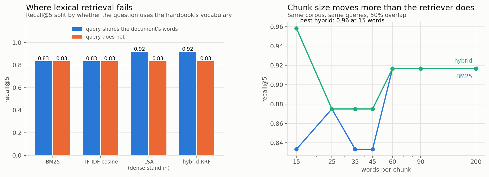

# Everyone builds retrieval. Almost nobody measures it.

*Synthetic corpus. `src/retrieval.py` runs everything below. Nothing here calls an
API, and that is the point.*

The center wants staff to ask the operations handbook a question instead of
interrupting the director. That is a retrieval problem before it is a language-model
problem, and no model rescues a retriever that did not surface the right passage. At
recall@5 of 0.6, four answers in ten are confabulated regardless of what writes them.

So this is the part that gets skipped: a labelled evaluation set, four retrievers
scored against it, confidence intervals, and a sweep over the parameter that turns
out to matter more than the retriever choice does.

---

## The setup

14 handbook sections, 26 chunks, **24 hand-labelled queries** with 42
query/document judgements. Twelve of the queries are marked hard, meaning the
question shares little vocabulary with the passage that answers it:

| query | answer lives in |
|---|---|
| "how much does it cost" | tuition |
| "can we get money back if we stop halfway through the month" | refunds |
| "who is allowed to pick a student up" | safeguarding |
| "can I take the student list home" | technology |

That labelling took about an hour. In a real deployment it is the single
highest-return hour of the project, and it is the one everybody skips in favour of
swapping embedding models.

---

## The retrievers

**BM25**, written out rather than imported, because the length-normalisation term is
the whole reason it works and it is worth seeing:

$$\text{score}(q,d) = \sum_{t \in q} \text{idf}(t)\,\frac{f(t,d)\,(k_1+1)}{f(t,d) + k_1\left(1 - b + b\frac{|d|}{\text{avgdl}}\right)}$$

Without the $b$ term the longest handbook section wins every query by containing
more words.

**TF-IDF cosine.** **LSA**, a truncated SVD of the term-document matrix, standing in
for a dense encoder. It is not a substitute for one; it buys the same thing an
embedding buys, which is a query matching a passage that shares no words with it, and
it does so much more weakly. A real encoder moves the numbers and not the conclusion.

**Hybrid**, by reciprocal rank fusion, which combines rankings without requiring the
two score scales to be comparable. That is why it beats score averaging in practice.

---

## Results, with the interval that matters



| retriever | recall@5 | 95% CI | MRR | nDCG | easy | hard |
|---|---|---|---|---|---|---|
| BM25 | 0.833 | [0.69, 0.96] | 0.667 | 0.690 | 0.83 | 0.83 |
| TF-IDF cosine | 0.833 | [0.69, 0.96] | 0.667 | 0.690 | 0.83 | 0.83 |
| LSA | 0.875 | [0.75, 0.98] | 0.653 | 0.700 | 0.92 | 0.83 |
| hybrid RRF | 0.875 | [0.75, 0.98] | 0.668 | 0.702 | 0.92 | 0.83 |

Paired bootstrap, hybrid minus BM25: **+0.042 recall, 95% CI [0.000, 0.125]**.

The interval touches zero. On 24 queries these four retrievers are
**indistinguishable**, and any ranking of them is a ranking of noise. One query is
four points of recall here.

That is the most useful sentence in this document. The standard retrieval blog post
reports exactly these point differences on exactly this size of eval set and declares
a winner. The bootstrap costs four lines and prevents it.

---

## What actually moved the number

| words per chunk | chunks | BM25 | hybrid |
|---|---|---|---|
| **15** | 90 | 0.833 | **0.958** |
| 25 | 56 | 0.875 | 0.875 |
| 35 | 42 | 0.833 | 0.875 |
| 45 | 26 | 0.833 | 0.875 |
| 60 | 15 | 0.917 | 0.917 |
| 90 | 14 | 0.917 | 0.917 |
| 200 | 14 | 0.917 | 0.917 |

Chunk size swings the hybrid from 0.875 to **0.958**, which is roughly double the
spread between any two retrievers at a fixed chunk size. It is one parameter, it
costs nothing to sweep, and it is almost never tuned.

The mechanism is not mysterious. Too large and the answer's signal is diluted by the
rest of the section; too small and the answer is split across two chunks so neither
one wins. There is a middle and it is findable in an afternoon, and it is worth more
than a month of comparing encoders.

Caveat, since the whole document is about not overclaiming: 14 documents is a tiny
corpus, all of these numbers are high, and the chunk-size effect would need a real
corpus to size properly. What transfers is the ordering of what to spend effort on,
not the specific numbers.

---

## The queries the best retriever still misses

Naming failures is more useful than reporting a mean.

- *"how quickly should we call someone who enquired"* → wanted marketing, got
  scheduling. "Call" and "hours" appear in the attendance section too.
- *"where do new families come from"* → wanted marketing and referrals, found
  referrals only.
- *"can I take the student list home"* → wanted technology, got assessment and
  safeguarding. Nothing in the data-handling section uses the word "home."
- *"can an instructor agree to a discount"* → wanted complaints and tuition, got
  instructors. The word "instructor" dominates.

Three of the four are vocabulary mismatches, which is precisely the failure a real
encoder fixes and a lexical retriever cannot. That is the argument for spending money
on embeddings, and note that it is an argument grounded in four named failures rather
than in a leaderboard.

---

## What I would do next

**Fix chunking before touching the model.** It is free and it moved more here.

**Add query rewriting.** Three of four remaining failures are the user and the
document using different words for the same thing. Expanding the query before
retrieval is cheaper than replacing the index.

**Keep the eval set and grow it.** Every failure a staff member reports becomes a
labelled row. That file is the only asset in a retrieval system that appreciates,
because models and indexes get replaced and judgements do not.

---

## Run it

```bash
python src/retrieval.py
```
