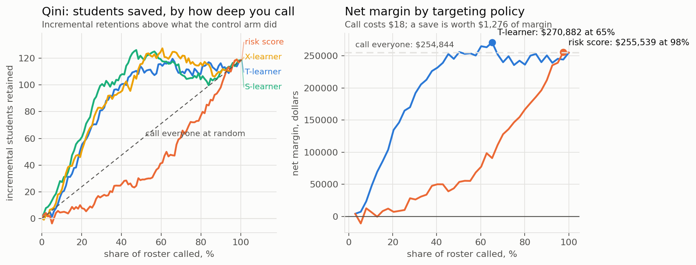

# Who to call is not who is going to leave

*Synthetic randomised trial. `src/uplift.py` runs everything below.*

MODELING.md produces a list of students ranked by how likely they are to leave.
Calling down that list is the standard retention playbook, and on this data it is
**worse than calling people at random.**

Not marginally worse. Its Qini coefficient is **−17.3**, against +33.1 for a proper
uplift model, and its correlation with the true treatment effect is **−0.06**.
Targeting the students most likely to churn is, to a first approximation, targeting
noise.

---

## Why the churn model is the wrong instrument

Split the roster by what a retention call actually does to each student.

| | call works | call does nothing |
|---|---|---|
| **would have left** | persuadables — the entire return | lost causes |
| **would have stayed** | sleeping dogs — worse than wasted | sure things |

A churn model scores persuadables, lost causes and sleeping dogs identically high,
because all three are at risk. Only the first column pays, and the bottom-left cell
actively loses money: a call that opens with "we noticed you've been thinking about
stopping" can put the idea on the table for someone who wasn't holding it.

So the quantity you want is not

$$\Pr(\text{churn} \mid x)$$

but the difference the intervention makes,

$$\tau(x) = \Pr(\text{stay} \mid \text{called}, x) - \Pr(\text{stay} \mid \text{not called}, x)$$

and that is a causal contrast, not a prediction. **It cannot be estimated from
observational data at all**, because no student is ever observed both called and
not called. There is no label. Every method below is a way of routing around a
missing outcome rather than fitting one.

The simulation here makes the call's effect deliberately non-monotone in engagement:
strongest for a wavering student around 72% first-eight-week attendance, nil for the
already-disengaged, nil for the reliably-present, and mildly negative for
high-attendance students who are also struggling academically. Churn risk, meanwhile,
falls monotonically in attendance. So the highest-risk students sit squarely in the
lost-cause region, and risk-ranking targets precisely the people the call cannot
help. That is the whole failure, in one sentence.

---

## Four estimators

**T-learner.** One model per arm, subtract. Simple and unbiased in structure; it
spends half the data on each model.

**S-learner.** One model with treatment as a feature, predict twice with the flag
flipped. Uses all the data. The standard objection is that a boosted tree will
happily ignore one binary column whose effect is small, shrinking $\hat\tau$ toward
zero.

**X-learner.** Impute each unit's missing potential outcome using the other arm's
model, fit $\tau$ on the imputed contrasts, blend by propensity. Designed for
lopsided arms.

**Risk score.** The churn model, included because it is what people actually do.

### Results

| model | Qini | corr. with true τ | net margin at 20% depth | at 40% |
|---|---|---|---|---|
| **S-learner** | **33.1** | **0.310** | **\$146,523** | **\$249,912** |
| X-learner | 30.6 | 0.239 | \$117,296 | \$219,687 |
| T-learner | 27.7 | 0.218 | \$136,113 | \$227,881 |
| risk score | **−17.3** | −0.060 | \$10,800 | \$45,465 |



At 20% depth the uplift model returns **thirteen times** what the risk model does
off the same budget.

The S-learner winning is worth a sentence, because it inverts the usual ordering.
The textbook concern about the S-learner is dilution, and dilution bites when the
treatment effect is small relative to the outcome's other variation. Here the average
effect is **+10.9 percentage points** of twelve-month retention, which is enormous,
and the arms are balanced at 6,000 students. In that regime the S-learner's data
efficiency dominates and the X-learner's imbalance machinery has nothing to correct.
Reporting the textbook ordering rather than the measured one would have been easier
and wrong.

---

## When is targeting worth doing at all?

This is the part usually skipped, and it is the part an owner asks about.

A phone call costs about \$18 of staff time. A saved student is worth roughly
\$1,276 of contribution margin. At a 70:1 payoff ratio the wasted calls are almost
free, so the naive policy of calling everyone is genuinely hard to beat.

| intervention cost | call everyone | best targeted | optimal depth | risk-ranked |
|---|---|---|---|---|
| \$18 | \$254,844 | \$292,607 | 45% | \$255,539 |
| \$80 | \$106,044 | \$225,275 | 45% | \$110,459 |
| \$120 | \$10,044 | \$181,835 | 45% | \$16,859 |
| \$160 | **−\$85,956** | \$138,395 | 45% | −\$6,077 |
| \$220 | −\$229,956 | \$89,531 | 30% | −\$10,397 |
| \$300 | −\$421,956 | \$35,881 | 28% | −\$16,157 |

Targeting wins at every cost tested, but look at *how* the advantage grows. At \$18
it is a 15% improvement, real but not dramatic. At \$160 blanket outreach **loses
\$86,000** while the targeted policy still makes \$138,000, and the optimal depth
starts contracting as the intervention gets expensive enough that only the clearest
persuadables are worth it.

So the practical rule: for a cheap intervention, skip the modelling and call
everyone, and spend the saved effort on making the call better. The moment the
intervention becomes an offer, a free month, a discount, or an hour of the
director's time, uplift modelling is worth more than the offer itself.

That crossover is the deliverable. Not the model.

---

## What this does not establish

The whole analysis rests on an experiment. Randomisation is what makes $\tau$
identifiable, and without it every number above is uninterpretable, because the
students a director chooses to call are exactly the students whose outcomes differ
for other reasons. Retention programmes are almost never run with a holdout, which
is why almost no centre knows whether theirs works.

Running one is cheap. Withhold the call from a random third of eligible students for
one term. That single decision converts the entire retention budget from an article
of faith into a measured quantity, and it costs a third of a term's calls.

---

## Run it

```bash
python src/uplift.py    # simulates the trial, fits four estimators, writes charts/uplift.png
```
